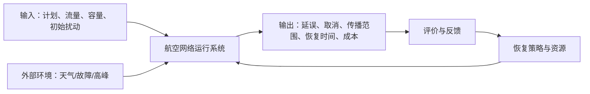
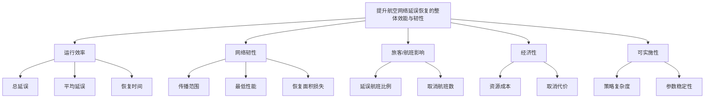

# FlightResilience 项目总工作流计划（PLAN.md）

> **项目正式题目**  
> 面向突发扰动的航空网络延误传播识别与恢复策略决策——基于 BTS 公开数据的系统工程建模与 Web 仿真
>
> **Web Demo 名称**  
> FlightResilience：航空网络延误传播与恢复决策支持系统
>
> **项目类型**  
> 系统分析 + 数据建模 + 复杂网络 + 动态仿真 + 多目标优化 + 系统评价 + 风险决策 + Web 演示
>
> **汇报约束**  
> 课堂展示 7 分 30 秒；PPT 页数不严格限制；小组一般不超过 3 人；报告须内容深入、图表美观、包含 Web Demo 截图；演示文档与必要程序文件按要求提交。
>
> **计划定位**  
> 本文件不是简单的任务清单，而是项目从立项、数据、模型、仿真、评价、决策、Web 开发、报告、PPT、讲稿到答辩验收的统一“主控文档”。后续所有代码、图表、文稿和演示均应以本计划为基线，变更必须记录。

---

## 0. 项目成功标准

项目最终必须形成一个闭环，而不是若干互不连接的算法：

```text
公开真实数据
    ↓
系统问题界定与目标分解
    ↓
影响因素结构分析（鱼骨图 + 数据辅助 ISM）
    ↓
航班延误预测与解释
    ↓
机场复杂网络与关键节点识别
    ↓
延误动态传播模型与冲击仿真
    ↓
恢复策略设计与多目标优化
    ↓
系统综合评价与风险决策
    ↓
Web 决策支持 Demo
    ↓
完整报告 + 精简 PPT + 7分30秒讲稿
```

### 0.1 必须交付的成果

- [ ] 一份结构完整、图表丰富、可独立阅读的研究报告
- [ ] 一份适合 7 分 30 秒讲解的精简 PPT
- [ ] 一份按页、按秒分配的完整讲稿
- [ ] 一个可本地运行的 Streamlit Web Demo
- [ ] 一套可复现的数据处理、建模、仿真、评价代码
- [ ] Web Demo 的高清截图及必要的录屏备份
- [ ] 原始数据来源说明、数据字典与处理记录
- [ ] 小组分工表、贡献说明与项目日志
- [ ] `README.md`、`requirements.txt`、运行命令和复现说明
- [ ] 报告附录中的模型公式、参数表、AHP 判断矩阵、决策矩阵、补充图表

### 0.2 最低验收线

满足以下条件才可进入最终排版：

1. 数据来自 BTS 官方或可追溯到 BTS 的 Kaggle 镜像，不使用虚构“真实数据”。
2. 预测模型使用时间顺序划分训练集和测试集，避免随机划分造成数据泄漏。
3. 机场网络、延误传播和恢复策略之间存在明确的数据与数学连接。
4. 至少比较 4 种恢复策略，并用同一组情景、指标和预算进行公平比较。
5. 至少完成一种课程内评价方法和一种课程内决策方法。
6. Web Demo 展示的是实际预计算或实时计算结果，不是静态空壳页面。
7. 报告中的每张图都有编号、标题、解释和数据来源。
8. PPT 中不堆公式，不展示无法在 7 分 30 秒内解释的模型。
9. 对模型局限、数据限制和仿真假设进行明确披露。
10. 结论不得把相关性、SHAP 贡献或滞后关系直接表述为严格因果关系。

---

# 1. 课程知识映射与方法总框架

## 1.1 第一章：系统工程基本观点

本项目应始终体现以下系统特性：

| 系统特性 | 在航空延误项目中的体现 |
|---|---|
| 整体性 | 研究对象不是单个航班，而是机场—航线—航班—航空公司构成的网络运行整体 |
| 关联性 | 一个机场或前序航班的延误会通过航线、资源周转和时刻安排影响其他节点 |
| 环境适应性 | 系统受到天气、流量高峰、容量下降和局部故障等外部扰动 |
| 功能性 | 系统功能是安全、稳定、高效地完成航空运输任务 |
| 层次性 | 航班层、机场层、航线层、网络层、决策层具有不同指标和功能 |
| 多元性 | 机场、航空公司、旅客、管理部门等主体目标不同 |
| 多维性 | 延误、取消、成本、恢复速度、稳定性、可实施性等评价维度并存 |

课程强调系统工程面向复杂系统的预测、规划、评价和决策，交通运输系统工程包含空运规划、调度、优化模型及效益分析。因此，本选题在研究对象和方法上与课程直接匹配。

## 1.2 第二章：系统工程方法论

### 霍尔三维结构作为项目总骨架

本项目按照霍尔逻辑维组织：

1. 明确问题
2. 系统设计
3. 方案综合
4. 建立模型
5. 方案优化
6. 做出决策
7. 付诸实施与反馈

对应关系如下：

| 霍尔逻辑步骤 | 本项目具体任务 | 核心产出 |
|---|---|---|
| 明确问题 | 收集背景、定义系统边界、识别现实系统与目标系统的差距 | 问题陈述、研究问题、系统边界图 |
| 系统设计 | 分解目标、确定指标、约束、利益相关者和评价主体 | 目标树、指标体系、5W1H |
| 方案综合 | 形成基准、缓冲、枢纽优先、动态组合 4 类策略 | 策略定义表 |
| 建立模型 | 预测模型、机场网络、ISM、状态空间/传播模型 | 数学模型与代码 |
| 方案优化 | 在资源预算下搜索策略参数与 Pareto 解 | 参数组合与优化结果 |
| 做出决策 | AHP/熵权/TOPSIS、模糊评价、风险决策树 | 综合排名和推荐策略 |
| 付诸实施 | 将模型封装为 Web Demo，并提出实际实施路径 | Demo、实施建议、反馈机制 |

### 切克兰德方法论作为“软系统”补充

航空恢复不是纯数学最优问题。乘客、航空公司、机场和监管者对“最优”的理解不同，因此采用“可行、满意、非劣”而不是宣称存在唯一绝对最优。

建议使用 CATWOE 方式形成根底定义：

| 要素 | 本项目解释 |
|---|---|
| C：Customers | 乘客、航空公司运营部门、机场管理者 |
| A：Actors | 调度人员、机场运行控制人员、数据分析人员、模型系统 |
| T：Transformation | 从被动响应延误转为预测驱动、网络协同的恢复决策 |
| W：Worldview | 局部最优可能加剧全网延误，应追求整体协调和韧性 |
| O：Owners | 航空公司或机场运行控制中心 |
| E：Environment | 天气、政策、安全要求、资源预算、时刻表和机场容量 |

### 系统分析的六要素

- **问题**：现实系统存在延误传播、恢复缓慢和局部策略缺乏全局协调。
- **目的与目标**：降低总延误、传播范围、取消量和恢复成本，提高恢复速度与网络韧性。
- **方案**：至少 4 个备选恢复策略。
- **模型**：预测模型、网络模型、结构模型、动态传播模型、优化模型。
- **评价**：从效率、韧性、影响、经济性和可实施性评价。
- **决策者**：以“机场—航空公司联合运行控制中心”为抽象决策主体。

## 1.3 第三章：系统模型化

课程要求模型兼顾现实性与易处理性，并按“明确问题—建立目标—确定要素—明确关系—量化参数—选择形式—简化—求解—检验与修订”推进。

本项目建立五类模型：

1. **结构模型**：鱼骨图与 ISM。
2. **预测模型**：航班到达延误分类/概率预测。
3. **网络模型**：机场有向加权图。
4. **动态模型**：机场小时级延误状态空间或受约束传播模型。
5. **评价与决策模型**：AHP、熵权、TOPSIS、模糊综合评价和风险决策树。

模型不是越复杂越好。任何高级模型必须满足：

- 可解释；
- 可复现；
- 可验证；
- 能与前后环节连接；
- 能在报告和 7 分 30 秒 PPT 中讲清楚。

## 1.4 第四章：系统评价

系统评价按 5W1H 明确：

| 维度 | 内容 |
|---|---|
| What | 四种恢复策略 |
| Who | 联合运行控制决策主体；不同权重代表不同管理偏好 |
| Why | 选择兼顾延误、成本、恢复速度和可实施性的满意方案 |
| When | 冲击发生后的方案前评估与模拟运行后的期末评价 |
| Where | 选定的美国主要机场网络 |
| How | AHP + 熵权 + TOPSIS；模糊综合评价作为等级解释；关联矩阵作简化复核 |

## 1.5 第五章：系统决策

- 当情景概率可从历史样本频率估计时，采用**风险型决策**：期望值法、决策树。
- 当概率无法可靠估计时，采用**不确定型决策**：悲观准则、乐观准则、Laplace 准则、最小最大后悔值和折中准则。
- 多目标决策使用 Pareto 前沿与综合评价，不将所有冲突目标粗暴压成单一准确率。

## 1.6 创新方法的合理使用

| 方法 | 用途 | 是否进入 PPT |
|---|---|---|
| 5W1H | 问题和评价设计 | 可简要体现 |
| 鱼骨图 | 延误成因分类 | 是 |
| 情景分析 | 构造正常、高峰、天气、枢纽故障状态 | 是 |
| 标杆法 | 比较基准策略与改进策略 | 报告中体现 |
| 数据辅助 ISM | 形成因素递阶结构 | 是 |
| SHAP | 解释预测模型 | 是 |
| 复杂网络 | 识别关键机场 | 是 |
| 状态空间/传播模型 | 动态仿真 | 是 |
| NSGA-II 或网格搜索 | 多目标参数优化 | 报告为主 |
| 敏感性分析 | 检验权重、阈值和冲击参数稳健性 | 是，简图 |

> 原则：每个方法必须解决一个明确问题，禁止为“方法数量多”而机械堆叠。

---

# 2. 研究定位、问题与假设

## 2.1 一句话问题陈述

现有延误研究常停留在“单航班是否延误”的预测层面，但航空运输是高度关联的动态网络；本项目研究局部扰动如何在机场网络中传播，以及在有限恢复资源下如何选择兼顾效率、成本与韧性的恢复策略。

## 2.2 研究目标

### 总目标

构建一个基于公开真实数据的航空网络延误传播与恢复决策支持系统，实现“预测—传播—仿真—优化—评价—决策”的闭环。

### 分目标

1. 描述选定机场网络的延误时空规律。
2. 预测单航班发生 15 分钟以上到达延误的概率。
3. 识别对全网延误传播影响较大的关键机场。
4. 建立机场小时级延误传播模型。
5. 构造不同强度、不同类型的突发扰动。
6. 比较 4 类恢复策略在相同资源约束下的表现。
7. 通过系统评价和风险决策给出情景化策略建议。
8. 将分析成果封装成可交互 Web Demo。

## 2.3 研究问题

- **RQ1**：航班延误在时间、机场、航空公司和航线上呈现哪些规律？
- **RQ2**：在不使用未来信息的前提下，哪些变量可以有效预测到达延误？
- **RQ3**：哪些机场兼具高流量、高中心性和高延误传播风险？
- **RQ4**：延误如何在机场网络中随时间传播，传播矩阵是否具有稳定且可解释的结构？
- **RQ5**：不同恢复策略在正常、高峰、天气和关键枢纽容量下降情景下表现如何？
- **RQ6**：在不同管理偏好和不确定状态下，最终推荐方案是否稳定？

## 2.4 可检验假设

- **H1**：机场当前拥堵状态、时段、航线历史延误率和运营主体特征对延误概率具有显著解释力。
- **H2**：高中心性机场发生延误时，延误传播范围和恢复时间高于普通机场。
- **H3**：仅增加统一缓冲能降低传播，但可能以效率和资源成本为代价。
- **H4**：关键枢纽优先策略优于完全平均分配资源。
- **H5**：融合预测风险、网络中心性和实时延误状态的动态组合策略在多数情景下具有更优的综合评价。
- **H6**：当权重和状态概率在合理范围内变化时，推荐策略不会频繁反转；若反转，应明确触发条件。

---

# 3. 研究范围与边界控制

## 3.1 推荐主范围

- 时间：2024 年 1—3 月。
- 空间：按航班量筛选前 15 个机场。
- 数据粒度：
  - 航班预测：单航班。
  - 网络分析：机场—机场航线。
  - 动态仿真：机场—小时。
- 目标变量：`ArrDel15`，即到达延误是否达到 15 分钟。
- 主要结果指标：总延误、平均延误、延误航班比例、传播范围、恢复时间、策略成本、综合韧性。

## 3.2 可伸缩范围

| 资源情况 | 时间范围 | 机场数量 | 数据规模建议 |
|---|---:|---:|---:|
| 低配电脑/时间紧 | 2024 年 1 月 | 前 10 | 10万—30万行 |
| 标准版本 | 2024 年 1—3 月 | 前 15 | 30万—100万行 |
| 提升版本 | 2024 年 1—6 月 | 前 20 | 100万—300万行 |

## 3.3 明确不做的内容

- 不做实时航班追踪。
- 不声称建立真实航空公司生产级调度系统。
- 不对乘客人数进行无数据支撑的精确估算。
- 不强行还原每架飞机的完整尾号周转链，除非数据字段完整且时间允许。
- 不使用未来实际起降信息作为计划阶段预测特征。
- 不将天气延误原因字段直接当作预测时已知天气信息。
- 不把模型输出解释为严格因果结论。
- 不在 PPT 中展示所有附录模型和参数。

---

# 4. 数据获取、版本管理与数据字典

## 4.1 数据源优先级

### 方案 A：BTS 官方 TranStats

优点：官方、字段定义清晰、可按月下载。  
缺点：下载和字段选择操作较繁琐。

### 方案 B：Kaggle 的 2024 Flight Delay Dataset

优点：已将 BTS 月度文件合并，超过 700 万行、约 35 列，便于快速起步。  
缺点：必须核对字段、来源和处理说明，不能只写“Kaggle 数据”。

### 推荐策略

1. 先使用 Kaggle 镜像快速开发。
2. 用 BTS 官方字段说明核对关键变量。
3. 报告统一表述为“数据源自美国交通部 BTS，使用 Kaggle 整理镜像进行计算”。
4. 在附录保存数据下载日期、文件名、文件大小和哈希值。

## 4.2 推荐字段

| 类别 | 字段示例 | 用途 |
|---|---|---|
| 日期 | `FlightDate`, `Month`, `DayOfWeek` | 时间特征 |
| 运营主体 | `Operating_Airline`, `Marketing_Airline_Network` | 航空公司特征 |
| 航班标识 | `Flight_Number_Operating_Airline` | 去重与追踪 |
| 机场 | `Origin`, `Dest` | 网络节点和航线 |
| 计划时间 | `CRSDepTime`, `CRSArrTime`, `CRSElapsedTime` | 计划阶段特征 |
| 实际时间 | `DepTime`, `ArrTime`, `ActualElapsedTime` | 事后分析，不可随意用于计划预测 |
| 延误 | `DepDelay`, `ArrDelay`, `ArrDelayMinutes`, `ArrDel15` | 目标和状态变量 |
| 地面运行 | `TaxiOut`, `TaxiIn` | 事后诊断或滚动预测 |
| 异常 | `Cancelled`, `CancellationCode`, `Diverted` | 数据过滤与情景分析 |
| 距离 | `Distance` | 航线特征 |
| 原因 | `CarrierDelay`, `WeatherDelay`, `NASDelay`, `SecurityDelay`, `LateAircraftDelay` | 事后解释，谨防泄漏 |

## 4.3 两层预测任务，防止数据泄漏

### M1：计划阶段预测模型（主模型）

预测时点：航班起飞前，只使用计划阶段可获得信息。

可用：

- 日期、星期、月份；
- 计划起飞时段；
- 出发地、目的地、航空公司；
- 距离、计划飞行时间；
- 基于历史训练期计算的机场/航线/航空公司延误率；
- 同日此前时段的机场拥堵状态，但必须严格按时间生成。

禁用：

- 实际起飞时间；
- 实际出发延误；
- 滑行时间；
- 到达延误；
- 延误原因分解；
- 任何测试期未来统计量。

### M2：滚动更新模型（可选提升）

预测时点：计划起飞前 30 分钟或实际推出后。

可增加：

- 当前机场近 1—3 小时延误率；
- 当前机场待处理航班量；
- 已知出发延误；
- 实时状态代理变量。

PPT 以 M1 为主，报告可比较 M1 与 M2，说明信息价值。

## 4.4 数据目录和不可变原则

```text
data/
├── raw/                 # 原始文件，只读，不修改
├── external/            # 机场经纬度、机场名称等外部表
├── interim/             # 清洗中间结果
├── processed/           # 模型输入数据
├── features/            # 特征表
└── demo/                # Web Demo 使用的小型预计算数据
```

规则：

- 原始数据绝不覆盖。
- 每次处理输出新文件。
- 保存 `data_manifest.csv`：
  - 文件名；
  - 来源；
  - 下载日期；
  - 行数、列数；
  - 文件大小；
  - SHA256；
  - 处理脚本版本。
- 大文件优先使用 Parquet。
- Web 部署不上传完整原始数据，只上传聚合数据和模型产物。

## 4.5 数据清洗顺序

1. 检查编码和列名。
2. 去除完全重复记录。
3. 将日期和时间字段转为标准格式。
4. 对取消和备降航班分流处理。
5. 对延误分钟数的异常值进行描述，不随意截断。
6. 过滤选定时间段和机场。
7. 检查 `ArrDel15` 与 `ArrDelayMinutes` 的一致性。
8. 构造 `route = Origin + "-" + Dest`。
9. 构造计划起飞小时和时间块。
10. 按日期时间排序。
11. 基于训练期生成历史统计特征。
12. 输出清洗日志和缺失值报告。

## 4.6 时间划分

标准版本：

- 训练集：2024-01-01 至 2024-02-15
- 验证集：2024-02-16 至 2024-02-29
- 测试集：2024-03-01 至 2024-03-31

严禁在全数据上计算机场历史延误率后再切分。所有聚合特征必须由训练期拟合，并以滚动或映射方式应用到验证/测试集。

---

# 5. 项目仓库与技术环境

## 5.1 推荐技术栈

- Python
- Pandas 或 Polars
- DuckDB：快速查询大 CSV/Parquet
- NumPy / SciPy
- scikit-learn
- LightGBM 或 XGBoost
- SHAP
- NetworkX
- Plotly
- Matplotlib
- Pymoo（提升版 NSGA-II）
- Streamlit
- Joblib
- PyArrow

## 5.2 仓库结构

```text
FlightResilience/
├── PLAN.md
├── README.md
├── requirements.txt
├── environment.yml
├── .gitignore
├── configs/
│   ├── base.yaml
│   ├── scenarios.yaml
│   └── strategies.yaml
├── data/
│   ├── raw/
│   ├── external/
│   ├── interim/
│   ├── processed/
│   ├── features/
│   └── demo/
├── notebooks/
│   ├── 00_data_audit.ipynb
│   ├── 01_eda.ipynb
│   ├── 02_feature_engineering.ipynb
│   ├── 03_delay_prediction.ipynb
│   ├── 04_network_analysis.ipynb
│   ├── 05_ism.ipynb
│   ├── 06_propagation_model.ipynb
│   ├── 07_strategy_simulation.ipynb
│   ├── 08_evaluation_decision.ipynb
│   └── 09_report_figures.ipynb
├── src/
│   ├── data/
│   │   ├── load.py
│   │   ├── clean.py
│   │   └── validate.py
│   ├── features/
│   │   ├── time_features.py
│   │   ├── rolling_features.py
│   │   └── network_features.py
│   ├── models/
│   │   ├── baseline.py
│   │   ├── delay_model.py
│   │   ├── calibration.py
│   │   └── explain.py
│   ├── network/
│   │   ├── build_graph.py
│   │   ├── metrics.py
│   │   └── communities.py
│   ├── ism/
│   │   ├── relation_matrix.py
│   │   ├── reachability.py
│   │   └── hierarchy.py
│   ├── simulation/
│   │   ├── state_builder.py
│   │   ├── estimate_A.py
│   │   ├── scenarios.py
│   │   ├── strategies.py
│   │   └── simulator.py
│   ├── optimization/
│   │   ├── objectives.py
│   │   ├── grid_search.py
│   │   └── nsga2.py
│   ├── evaluation/
│   │   ├── ahp.py
│   │   ├── entropy.py
│   │   ├── topsis.py
│   │   ├── fuzzy.py
│   │   └── decision_tree.py
│   └── viz/
│       ├── theme.py
│       ├── report_charts.py
│       └── network_plots.py
├── scripts/
│   ├── 01_prepare_data.py
│   ├── 02_train_model.py
│   ├── 03_build_network.py
│   ├── 04_fit_propagation.py
│   ├── 05_run_simulation.py
│   ├── 06_rank_strategies.py
│   └── 07_export_demo_assets.py
├── app/
│   ├── Home.py
│   ├── pages/
│   │   ├── 1_数据驾驶舱.py
│   │   ├── 2_延误风险预测.py
│   │   ├── 3_机场网络.py
│   │   ├── 4_扰动仿真.py
│   │   └── 5_策略决策.py
│   └── assets/
├── reports/
│   ├── figures/
│   ├── tables/
│   ├── screenshots/
│   ├── report.docx
│   └── report.pdf
├── slides/
│   ├── presentation.pptx
│   ├── script.md
│   └── demo_recording.mp4
└── tests/
    ├── test_data.py
    ├── test_ism.py
    ├── test_simulation.py
    └── test_evaluation.py
```

## 5.3 环境初始化

```bash
python -m venv .venv

# Windows
.venv\Scripts\activate

# macOS/Linux
source .venv/bin/activate

pip install -r requirements.txt
```

运行主流程：

```bash
python scripts/01_prepare_data.py
python scripts/02_train_model.py
python scripts/03_build_network.py
python scripts/04_fit_propagation.py
python scripts/05_run_simulation.py
python scripts/06_rank_strategies.py
python scripts/07_export_demo_assets.py
streamlit run app/Home.py
```

## 5.4 可复现规则

- 固定随机种子，例如 `RANDOM_SEED = 42`。
- 所有阈值写入 YAML，不硬编码在 Notebook 中。
- Notebook 用于探索；最终结果必须由 `scripts/` 或 `src/` 可重复生成。
- 图表和表格由脚本导出，不手工修改数据点。
- 模型、特征列表、训练区间和评估结果保存为 JSON。
- 每次关键实验记录 Git commit 或版本号。

---

# 6. 第一阶段：问题识别与系统设计

## 6.1 系统边界图

### 系统内部

- 航班计划
- 航空公司运营
- 机场容量
- 航线连接
- 航班到达与离港
- 延误状态
- 调度与恢复资源
- 决策支持模型

### 外部环境

- 天气与空域限制
- 突发流量
- 基础设施故障
- 安全与监管约束
- 节假日和季节性

### 输入—处理—输出



## 6.2 目标树



## 6.3 鱼骨图因素

建议因素分类：

- **人/组织**：跨机场协同不足、调度响应滞后、资源分配规则僵化。
- **机/设备**：飞机晚到、设备故障、跑道/廊桥能力下降。
- **料/资源**：可用机组、备用飞机、时间缓冲、机场容量。
- **法/流程**：航班排序、时刻安排、恢复优先级、取消规则。
- **环/环境**：天气、空域限制、节假日、需求高峰。
- **信息**：预测滞后、状态共享不足、风险识别不准确。

鱼骨图用于形成候选因素，不直接作为定量结论。

## 6.4 利益相关者与冲突

| 主体 | 主要目标 | 可能冲突 |
|---|---|---|
| 乘客 | 少延误、少取消、信息透明 | 与航空公司成本控制冲突 |
| 航空公司 | 减少恢复成本、保持航班完成率 | 可能将压力转移至机场或后续航班 |
| 机场 | 避免局部超载、提高吞吐稳定性 | 枢纽优先可能挤压非枢纽资源 |
| 监管者 | 安全、公平、网络整体稳定 | 对单一企业局部最优形成约束 |
| 调度人员 | 策略简单、可执行、可解释 | 与复杂算法的理论最优冲突 |

---

# 7. 第二阶段：探索性数据分析与图表体系

## 7.1 EDA 必答问题

1. 延误比例与延误分钟数的总体分布如何？
2. 延误在月份、星期、小时上有何变化？
3. 哪些机场、航空公司和航线延误率最高？
4. 高航班量机场是否一定具有高延误率？
5. 取消、备降与普通延误的关系如何？
6. 延误原因字段如何分布？
7. 延误是否存在明显的空间集聚和时间持续性？
8. 机场小时级延误状态是否具有滞后相关？
9. 训练期、验证期、测试期分布是否发生漂移？

## 7.2 报告图表清单

### 数据与现状图

- 图 1：研究总体技术路线图
- 图 2：航空运行系统边界图
- 图 3：延误原因鱼骨图
- 图 4：数据处理流程图
- 图 5：字段缺失率横向条形图
- 图 6：延误分钟数分布与长尾局部放大图
- 图 7：每日航班量与延误率双轴趋势图
- 图 8：星期 × 起飞小时延误率热力图
- 图 9：主要机场航班量与延误率散点图
- 图 10：机场延误率 Top 15 横向条形图
- 图 11：航空公司延误率与取消率对比图
- 图 12：延误原因构成图
- 图 13：训练/验证/测试目标比例对比图

### 模型图

- 图 14：逻辑回归、随机森林、LightGBM 指标对比
- 图 15：测试集混淆矩阵
- 图 16：ROC 与 PR 曲线
- 图 17：概率校准曲线
- 图 18：SHAP 全局特征重要性
- 图 19：典型航班 SHAP 局部解释

### 网络与结构图

- 图 20：主要机场航线网络图
- 图 21：机场中心性排名
- 图 22：机场流量—中心性—延误风险三维关系
- 图 23：ISM 邻接矩阵热力图
- 图 24：ISM 可达矩阵热力图
- 图 25：延误因素多级递阶结构图

### 动态与策略图

- 图 26：机场滞后延误关系矩阵
- 图 27：传播矩阵 A 热力图
- 图 28：关键机场冲击的脉冲响应曲线
- 图 29：四策略下全网性能恢复曲线
- 图 30：不同情景下总延误对比
- 图 31：传播范围与恢复时间对比
- 图 32：成本—延误 Pareto 前沿
- 图 33：AHP 指标层次结构
- 图 34：方案 TOPSIS 接近度
- 图 35：模糊综合评价等级分布
- 图 36：风险决策树
- 图 37：权重敏感性龙卷风图
- 图 38：推荐策略适用边界图
- 图 39—44：Web Demo 核心页面截图

## 7.3 图表视觉规范

### 报告

- 页面：A4。
- 正文：10.5—12 pt。
- 图宽统一为单栏或整页宽，不随意缩放。
- 位图至少 300 dpi；网络图、流程图优先 SVG/PDF。
- 中文字体统一使用可合法获取的系统字体，如微软雅黑、思源黑体或 Noto Sans CJK。
- 图标题置于图下，表标题置于表上。
- 每张图包含：
  - 编号；
  - 标题；
  - 注释；
  - 数据来源；
  - 必要的样本范围。
- 建议主色：
  - 深蓝 `#163A5F`
  - 青蓝 `#2F7EA8`
  - 蓝灰 `#7C93A6`
  - 橙色强调 `#E58B3A`
  - 风险红 `#C94C4C`
  - 背景灰 `#F4F6F8`
- 不使用彩虹色，不用 3D 柱状图，不使用过多饼图。

### PPT

- 16:9。
- 每页只保留一个结论。
- 大标题 30—36 pt，正文不低于 18 pt。
- 图中文字必须在投影环境下可读。
- 颜色与报告一致。
- 每页底部保留小号页码、数据来源或方法标签。
- PPT 图表尽量重新排版，不直接把报告整页截图贴入。

## 7.4 图表输出命名

```text
fig_01_research_framework.svg
fig_02_system_boundary.svg
fig_03_fishbone.png
fig_06_delay_distribution.png
fig_18_shap_summary.png
fig_20_airport_network.html
fig_29_recovery_curves.png
fig_34_topsis_score.png
```

---

# 8. 第三阶段：数据辅助 ISM 结构分析

## 8.1 因素集合

建议保留 10—12 个因素，避免层级图过密：

| 编号 | 因素 |
|---|---|
| S1 | 恶劣天气或空域限制 |
| S2 | 机场有效容量下降 |
| S3 | 高峰航班密度 |
| S4 | 航班计划紧凑 |
| S5 | 时间缓冲不足 |
| S6 | 上游/前序航班晚到 |
| S7 | 出发延误 |
| S8 | 地面滑行与排队增加 |
| S9 | 局部机场拥堵 |
| S10 | 跨机场延误传播 |
| S11 | 航班取消或严重延误 |
| S12 | 网络恢复时间增加 |

## 8.2 关系矩阵生成原则

不依赖外部问卷，采用“数据证据 + 机理约束 + 小组复核”的混合方式。

### 数据证据

- 时间先后关系；
- 滞后相关；
- Granger 检验或滞后回归；
- SHAP 重要性；
- 条件概率；
- 网络连接与传播结果。

### 机理约束

例如：

- 结果变量不能反向影响历史天气。
- 出发延误可影响到达延误和后续传播。
- 取消是结果，不作为同一时段的原因。
- 上游状态只能沿实际航线或合理资源链传播。

### 小组复核

三名成员分别给出 0/1 关系判断，出现分歧时必须记录理由。报告中称为“小组结构化判断”，不能冒充专家调查。

## 8.3 ISM 计算流程

1. 确定因素集合 \(S=\{S_1,\ldots,S_n\}\)。
2. 建立邻接矩阵 \(A_{\text{ISM}}\)，行影响列。
3. 加单位矩阵并进行布尔运算，求可达矩阵：
   \[
   M=(A_{\text{ISM}}+I)^r
   \]
4. 计算可达集合、先行集合和交集。
5. 逐层提取终止集，完成级位划分。
6. 识别强连接因素并缩约。
7. 生成骨架矩阵。
8. 绘制多级递阶有向图。
9. 根据航空运行含义解释根源层、传导层、直接层和结果层。
10. 与 SHAP、网络指标和仿真结果交叉验证。

## 8.4 ISM 验收标准

- [ ] 邻接矩阵来源可解释。
- [ ] 可达矩阵计算结果通过人工小样例验证。
- [ ] 层级划分无遗漏和重复。
- [ ] 强连接关系处理清楚。
- [ ] 递阶结构图节点不超过 12 个。
- [ ] 报告明确：ISM 表达的是结构性解释框架，不是严格因果识别。

---

# 9. 第四阶段：航班延误预测模型

## 9.1 目标定义

\[
y_i =
\begin{cases}
1, & \text{ArrDelayMinutes}_i \ge 15 \\
0, & \text{otherwise}
\end{cases}
\]

取消和备降航班的处理：

- 主分类模型可先排除取消/备降航班，保证目标一致。
- 取消率作为网络与策略评价指标单独建模或统计。
- 提升版可建立多分类：准点、延误、取消/备降。

## 9.2 特征工程

### 时间特征

- 月份
- 星期
- 是否周末
- 计划起飞小时
- 早晚高峰
- 周期编码：`sin(hour)`、`cos(hour)`

### 空间与运营特征

- Origin
- Dest
- route
- airline
- distance
- planned elapsed time

### 历史统计特征

仅由过去数据计算：

- 出发机场历史延误率
- 到达机场历史延误率
- 航线历史延误率
- 航空公司历史延误率
- 机场 × 时段历史延误率
- 机场近 1 小时、3 小时延误率
- 机场近 1 小时计划航班量
- 航线平均延误分钟数

### 网络特征

- 出发机场度中心性
- 介数中心性
- PageRank
- 航线权重
- 机场社区编号

## 9.3 模型序列

1. **朴素基线**：按训练集总体延误率预测。
2. **逻辑回归**：可解释基线。
3. **随机森林**：非线性对照。
4. **LightGBM/XGBoost**：最终候选模型。
5. 可选：概率校准模型。

## 9.4 评估指标

不能只看 Accuracy。

- ROC-AUC
- PR-AUC
- F1
- Recall
- Precision
- Brier Score
- Log Loss
- Calibration Error
- 混淆矩阵
- 不同机场、时段、航空公司的分组表现

如果系统更关心漏掉高风险航班，优先强调 Recall 与 PR-AUC。

## 9.5 模型解释

- 全局 SHAP：识别主要驱动变量。
- 局部 SHAP：解释典型高风险航班。
- PDP 或分箱曲线：展示拥堵状态与风险的非线性关系。
- 错误分析：
  - 高置信度误判；
  - 特定机场误差；
  - 高峰期误差；
  - 分布漂移。

## 9.6 模型验收

- [ ] 时间外测试集性能优于朴素基线。
- [ ] 延误概率具有基本校准。
- [ ] 特征无明显未来泄漏。
- [ ] 结果可用一页图解释。
- [ ] 保存模型和特征列表。
- [ ] Web Demo 单次预测响应时间可接受。
- [ ] 对类别不平衡采取合理处理，但不滥用随机过采样破坏时间结构。

---

# 10. 第五阶段：机场复杂网络分析

## 10.1 网络定义

- 节点：机场。
- 有向边：从 Origin 指向 Dest。
- 边权一：航班数量。
- 边权二：平均到达延误。
- 边权三：经验传播强度。
- 节点属性：
  - 航班量；
  - 延误率；
  - 取消率；
  - 中心性；
  - 模型预测平均风险。

## 10.2 关键指标

- 入度、出度
- 加权度
- 介数中心性
- 接近中心性
- PageRank
- 特征向量或 Katz 中心性
- 社区结构
- 网络密度
- 强连通分量

## 10.3 关键机场综合风险指数

可构造：

\[
K_i = \alpha \widetilde{V_i}
+ \beta \widetilde{B_i}
+ \gamma \widetilde{R_i}
+ \delta \widetilde{D_i}
\]

其中：

- \(V_i\)：航班量；
- \(B_i\)：介数中心性；
- \(R_i\)：预测延误风险；
- \(D_i\)：历史延误率；
- 波浪线表示归一化。

权重先设置等权，随后进行敏感性分析。该指数用于选取冲击机场和恢复优先级，不替代完整评价体系。

## 10.4 网络图要求

- 仅展示前 15 个机场，避免“毛线团”。
- 节点大小：航班量。
- 节点颜色：延误率或风险。
- 边宽：航班量。
- 点击节点显示：
  - 机场名称；
  - 航班量；
  - 延误率；
  - 中心性；
  - 主要连接机场。
- 报告同时提供：
  - 网络图；
  - 中心性排名表；
  - 流量—中心性—延误散点图。

---

# 11. 第六阶段：延误动态传播模型

## 11.1 状态变量

对 15 个机场按小时聚合：

\[
x_t =
[x_{1,t},x_{2,t},\ldots,x_{n,t}]^\top
\]

推荐定义：

\[
x_{i,t}=
\text{机场 }i\text{ 在小时 }t\text{ 的平均正延误分钟数}
\]

也可使用延误航班比例作为稳健性替代。

## 11.2 主模型

\[
x_{t+1}=A x_t+B u_t+G w_t+\varepsilon_t
\]

- \(A\)：机场间传播矩阵。
- \(u_t\)：恢复控制向量。
- \(B\)：恢复资源作用矩阵。
- \(w_t\)：外部扰动。
- \(G\)：扰动影响矩阵。
- \(\varepsilon_t\)：未建模噪声。

输出：

\[
y_t=Cx_t
\]

可令 \(C=I\)，直接观察各机场状态。

## 11.3 传播矩阵 A 的可执行估计方案

### 主方案：带网络掩码的 Ridge 滞后回归

对每个机场 \(j\)：

\[
x_{j,t+1}=\sum_i A_{ji}x_{i,t}+\epsilon_{j,t}
\]

只允许以下变量进入：

- 机场自身滞后状态；
- 与机场 \(j\) 有直接航线连接的机场；
- 可选的全网平均状态。

使用 Ridge 降低共线性。估计后：

1. 将不合理负传播系数截断或单独解释。
2. 对矩阵进行尺度控制。
3. 检查谱半径。
4. 若系统无控制时发散，进行稳定化处理并披露。

### 备用方案：流量份额 × 滞后相关

\[
A_{ji}=
\lambda \cdot
\text{routeShare}_{i\rightarrow j}
\cdot
\max(0,\text{lagCorr}_{i,j})
\]

再进行行/列归一化。该方法解释简单，适合主模型不稳定时作为 MVP。

## 11.4 模型检验

- 单步预测 MAE/RMSE。
- 与“保持上一时刻不变”基线比较。
- 传播矩阵与实际航线网络是否一致。
- 脉冲响应是否符合直觉。
- 不同时间段拟合的 A 是否稳定。
- 关键机场冲击是否比普通机场产生更大影响。
- 谱半径与稳定性说明。

## 11.5 冲击情景

| 情景 | 定义 | 参数化方法 |
|---|---|---|
| θ1 正常波动 | 小幅随机扰动 | 基于历史分位数 |
| θ2 需求高峰 | 多机场航班密度上升 | 状态或到达率提升 10%—30% |
| θ3 天气冲击 | 若干相关机场持续受扰 | 初始延误 + 容量下降 |
| θ4 关键枢纽故障 | 一个高中心性机场容量下降 | 选 Top 1—3 关键机场，下降 20%—50% |

所有参数均标注为：

- 历史估计；
- 数据分位数；
- 或仿真假设。

不得将仿真假设伪装为观测数据。

## 11.6 韧性指标

定义系统性能：

\[
P_t=1-\frac{\sum_i x_{i,t}}{D_{\max}}
\]

其中 \(D_{\max}\) 为归一化上界。

指标：

- **鲁棒性**：冲击后的最低性能。
- **快速性**：恢复到基准 90% 或 95% 所需时间。
- **恢复损失面积**：
  \[
  L_R=\sum_t(1-P_t)\Delta t
  \]
- **传播范围**：延误超过阈值的机场数量。
- **峰值总延误**。
- **累计总延误**。
- **受影响航班数**。
- **策略成本**。

---

# 12. 第七阶段：恢复策略设计

## 12.1 四种核心策略

### A：基准运行

- 不增加额外资源。
- 不修改优先级。
- 用于观察自然传播和恢复。

### B：统一缓冲策略

- 对所有航班或高风险航班增加固定缓冲。
- 在模型中将有效延误表示为：
  \[
  x'_{i,t}=\max(0,x_{i,t}-b)
  \]
- 参数：缓冲分钟数 \(b\)。

### C：关键枢纽优先策略

- 将固定恢复预算优先分配给中心性最高的机场。
- 排序依据：介数中心性或关键机场综合风险指数。
- 参数：优先机场数量 \(k\)、单机场资源量。

### D：预测—网络—状态动态组合策略

构造实时优先级：

\[
Priority_{i,t}
=
\alpha \cdot Risk_{i,t}
+\beta \cdot Centrality_i
+\gamma \cdot State_{i,t}
+\delta \cdot Downstream_i
\]

按优先级分配有限恢复资源，必要时对低影响航班进行延后或取消代理操作。

## 12.2 公平比较原则

四种策略必须使用：

- 同一初始状态；
- 同一扰动；
- 同一仿真时长；
- 同一资源预算；
- 同一成本系数；
- 同一随机种子集合；
- 同一评价指标。

否则方案排名没有意义。

## 12.3 成本代理

由于公开数据缺少真实企业成本，采用透明的相对成本：

\[
Cost=
c_1 \cdot \text{缓冲资源}
+c_2 \cdot \text{恢复资源}
+c_3 \cdot \text{取消数量}
+c_4 \cdot \text{策略复杂度}
\]

所有 \(c_i\) 为情景参数，并做敏感性分析。报告不得使用“美元成本”除非有可靠依据。

---

# 13. 第八阶段：优化与敏感性分析

## 13.1 MVP 优化

使用网格搜索：

- 缓冲：0、5、10、15、20 分钟
- 关键机场数量：1、3、5
- 资源预算：低、中、高
- 动态策略权重组合
- 风险阈值：0.3—0.8

目标：

\[
\min
\left[
D_{\text{total}},
T_{\text{recover}},
N_{\text{cancel}},
Cost,
Range
\right]
\]

## 13.2 提升版优化

使用 NSGA-II 生成 Pareto 前沿。

决策变量：

- \(b\)：缓冲时间
- \(k\)：优先机场数量
- \(r_i\)：资源分配比例
- \(\tau\)：高风险阈值
- \(\alpha,\beta,\gamma,\delta\)：动态优先级权重

约束：

- 总资源不超过预算；
- 取消比例不超过上限；
- 单机场资源有上限；
- 权重和为 1；
- 恢复控制不能使延误为负。

## 13.3 敏感性分析

必须至少覆盖：

1. 初始冲击强度。
2. 冲击持续时间。
3. 机场容量下降比例。
4. 总资源预算。
5. 传播矩阵缩放系数。
6. 策略成本系数。
7. AHP 与熵权组合系数。
8. 恢复阈值 90%/95%。
9. 预测概率阈值。
10. 状态概率估计误差。

结果表达：

- 龙卷风图；
- 策略排名稳定区间；
- 推荐策略适用边界图；
- 排名反转条件。

---

# 14. 第九阶段：系统评价

## 14.1 指标体系

| 一级指标 | 二级指标 | 类型 |
|---|---|---|
| 运行效率 | 累计总延误 | 成本型 |
| 运行效率 | 平均延误 | 成本型 |
| 运行效率 | 恢复时间 | 成本型 |
| 网络韧性 | 最低性能 | 效益型 |
| 网络韧性 | 恢复损失面积 | 成本型 |
| 网络韧性 | 传播范围 | 成本型 |
| 航班影响 | 延误航班比例 | 成本型 |
| 航班影响 | 取消数量 | 成本型 |
| 经济性 | 相对策略成本 | 成本型 |
| 可实施性 | 策略复杂度 | 成本型 |
| 稳健性 | 多情景方差 | 成本型 |

## 14.2 AHP 主观权重

步骤：

1. 建立目标层—准则层—指标层。
2. 三名组员独立填写判断矩阵。
3. 取几何平均形成群体判断矩阵。
4. 用方根法计算权重。
5. 计算 \(CI\)、\(RI\)、\(CR\)。
6. 若 \(CR\ge0.1\)，调整判断矩阵。
7. 保存完整判断矩阵至附录。

注意：如无外部专家，不写“专家赋权”，而写“小组决策主体判断”。

## 14.3 熵权客观权重

根据多情景仿真结果计算指标离散度。客观差异越明显，权重越高。

## 14.4 组合权重

\[
w_j=\lambda w_j^{AHP}+(1-\lambda)w_j^{Entropy}
\]

建议：

- 主结果：\(\lambda=0.5\)
- 敏感性：\(\lambda\in[0.2,0.8]\)

## 14.5 TOPSIS 排序

1. 构造策略—指标矩阵。
2. 对成本型和效益型指标正向化。
3. 标准化。
4. 乘组合权重。
5. 计算正理想解和负理想解。
6. 计算接近度：
   \[
   C_i=\frac{D_i^-}{D_i^++D_i^-}
   \]
7. 按 \(C_i\) 从高到低排序。

## 14.6 模糊综合评价

用于把数值结果解释为等级。

评语集：

\[
V=\{\text{优秀},\text{良好},\text{一般},\text{较差}\}
\]

根据指标分位数或业务阈值构造三角形/梯形隶属函数，得到隶属度矩阵 \(R\)，再计算：

\[
B=W\circ R
\]

输出各方案的等级隶属度，而不是只给单一分数。

## 14.7 关联矩阵复核

可在报告附录用课程中的关联矩阵法进行简化复核：

\[
V_i=\sum_j W_jV_{ij}
\]

如果关联矩阵排名与 TOPSIS 差异较大，需解释标准化与距离方法带来的差异。

---

# 15. 第十阶段：风险型与不确定型决策

## 15.1 益损矩阵

行：策略 A—D。  
列：情景 θ1—θ4。  
单元格：综合效用或负损失。

建议定义损失：

\[
Loss_{ij}
=
a D_{ij}
+b T_{ij}
+c C_{ij}
+d Range_{ij}
\]

## 15.2 风险型决策

若情景概率可以由历史频率近似：

- 正常状态概率；
- 高峰状态概率；
- 高延误/天气代理状态概率；
- 枢纽容量异常代理概率。

计算期望损失：

\[
EML(A_i)=\sum_j p_jLoss_{ij}
\]

选择期望损失最小策略。

绘制决策树：

- 决策点：选择策略；
- 状态点：情景；
- 概率枝：状态概率；
- 结果点：损失或效用；
- 从右向左逆推并剪枝。

## 15.3 不确定型决策

当状态概率不可靠时，同时计算：

- 乐观准则；
- 悲观准则；
- Laplace 等概率准则；
- 最小最大后悔值准则；
- Hurwicz 折中准则。

输出一个“准则—推荐策略”矩阵。

如果不同准则给出不同策略，结论应写成：

> 推荐方案取决于决策者风险偏好。风险承受能力低时选择稳健策略；资源充足且追求效率时选择动态组合策略。

## 15.4 信息价值（提升项）

比较：

- 无预测模型时的策略表现；
- 有预测风险信息时的策略表现。

定义预测信息的相对价值：

\[
VOI=
Loss_{\text{without info}}
-
Loss_{\text{with info}}
\]

该指标可将第五章“信息价值”与机器学习模型真正连接起来。

---

# 16. Web Demo 总体设计

## 16.1 设计原则

- Demo 不是普通聊天页或静态大屏。
- 每个页面回答一个决策问题。
- 页面顶部必须有一句“本页结论”。
- 默认加载预计算数据，确保现场稳定。
- 复杂模型提供“重新计算”按钮，但默认不在课堂现场完整训练。
- 支持本地离线运行。
- 所有关键页面提前截图。
- 准备 45—60 秒录屏作为故障备份。

## 16.2 页面一：项目首页

内容：

- 项目标题；
- 研究闭环；
- 数据范围；
- 关键指标卡；
- “进入仿真”按钮；
- 方法标签：系统分析、复杂网络、状态空间、综合评价、风险决策。

截图：`screen_01_home.png`

## 16.3 页面二：数据驾驶舱

筛选项：

- 日期范围；
- 出发机场；
- 到达机场；
- 航空公司；
- 起飞时段。

展示：

- 航班量；
- 延误率；
- 平均延误；
- 取消率；
- 时间热力图；
- 机场排名；
- 数据表下载。

截图：`screen_02_dashboard.png`

## 16.4 页面三：延误风险预测

输入：

- Origin
- Dest
- Airline
- Day of week
- Planned departure hour
- Distance
- 当前机场历史/滚动拥堵状态

输出：

- 延误概率；
- 风险等级；
- 预测阈值；
- 主要贡献因素；
- 模型免责声明。

截图：`screen_03_prediction.png`

## 16.5 页面四：机场网络

展示：

- 交互网络；
- 关键机场排名；
- 中心性与延误风险；
- 点击机场后的下游影响。

控件：

- 边权类型；
- 节点颜色指标；
- 显示机场数量；
- 网络过滤阈值。

截图：`screen_04_network.png`

## 16.6 页面五：扰动仿真

输入：

- 初始冲击机场；
- 冲击类型；
- 强度；
- 持续时间；
- 容量下降比例；
- 恢复预算；
- 恢复策略。

输出：

- 延误传播动画或逐时曲线；
- 全网性能恢复曲线；
- 传播范围；
- 累计延误；
- 恢复时间；
- 成本。

截图：

- `screen_05_scenario_input.png`
- `screen_06_simulation_result.png`

## 16.7 页面六：策略决策

展示：

- 四策略指标表；
- 雷达图；
- TOPSIS 排名；
- 模糊评价等级；
- 决策树；
- 敏感性分析；
- 最终建议与适用条件。

截图：`screen_07_decision.png`

## 16.8 Demo 数据资产

Web 不直接加载百万行数据，预先导出：

```text
data/demo/kpi_summary.parquet
data/demo/airport_hourly.parquet
data/demo/network_nodes.json
data/demo/network_edges.json
data/demo/model_metrics.json
data/demo/shap_summary.parquet
data/demo/scenario_results.parquet
data/demo/strategy_rankings.csv
models/delay_model.joblib
models/calibrator.joblib
```

## 16.9 现场演示固定路径

建议选择一个关键枢纽作为示例：

1. 首页用 5 秒说明系统闭环。
2. 数据页用 8 秒展示主要延误规律。
3. 网络页用 10 秒点击关键机场。
4. 仿真页选择“关键枢纽容量下降 30%，持续 4 小时”。
5. 先显示基准策略。
6. 切换动态组合策略。
7. 对比累计延误、传播范围和恢复时间。
8. 决策页展示综合排名和适用条件。

全程控制在 70—80 秒。

---

# 17. 完整研究报告设计

## 17.1 建议篇幅

- 正文：35—50 页。
- 附录：10—25 页。
- 图：30—45 幅。
- 表：15—25 个。
- 参考文献：课程课件、官方数据说明、方法文献、软件文档。
- 报告应能够独立阅读，不依赖 PPT 解释。

## 17.2 报告目录

### 封面

- 课程名称
- 项目题目
- 小组成员
- 学号
- 分工
- 提交日期

### 摘要

必须包含：

- 背景；
- 问题；
- 数据；
- 方法；
- 主要结果；
- 决策建议；
- 创新点。

控制在 500—800 字。

### 关键词

航空延误；复杂网络；系统工程；状态空间；系统评价；风险决策；Web 仿真

### 第 1 章 绪论

1.1 研究背景  
1.2 问题提出  
1.3 研究目的与研究问题  
1.4 研究内容  
1.5 技术路线  
1.6 研究创新  
1.7 报告结构

### 第 2 章 理论基础与方法体系

2.1 系统工程基本观点  
2.2 霍尔三维结构  
2.3 切克兰德软系统方法  
2.4 系统分析程序  
2.5 系统结构模型与 ISM  
2.6 状态空间模型  
2.7 系统评价方法  
2.8 风险型与不确定型决策  
2.9 复杂网络、机器学习与多目标优化补充方法  
2.10 方法间的逻辑关系

重点不是复述课件，而是说明每个方法为什么用于本项目。

### 第 3 章 系统问题界定与研究设计

3.1 现实系统与目标系统  
3.2 系统边界  
3.3 利益相关者与 CATWOE  
3.4 系统目标树  
3.5 评价 5W1H  
3.6 鱼骨图问题诊断  
3.7 研究假设  
3.8 备选恢复策略  
3.9 总体实验设计

### 第 4 章 数据来源、处理与特征构建

4.1 数据来源与可追溯性  
4.2 样本范围  
4.3 字段说明  
4.4 缺失值与异常值  
4.5 取消和备降处理  
4.6 时间顺序划分  
4.7 特征工程  
4.8 数据泄漏控制  
4.9 数据质量检验  
4.10 描述性统计

### 第 5 章 航班延误规律与结构分析

5.1 时间规律  
5.2 机场差异  
5.3 航线与航空公司差异  
5.4 延误原因构成  
5.5 数据辅助 ISM 因素确定  
5.6 邻接矩阵与可达矩阵  
5.7 级位划分与递阶结构  
5.8 结构解释与管理启示

### 第 6 章 航班延误预测与解释

6.1 预测任务与信息集  
6.2 基线模型  
6.3 逻辑回归  
6.4 随机森林  
6.5 LightGBM/XGBoost  
6.6 时间外测试结果  
6.7 概率校准  
6.8 SHAP 解释  
6.9 分组误差与模型局限  
6.10 预测信息价值

### 第 7 章 机场复杂网络与关键节点

7.1 网络构建  
7.2 网络整体特征  
7.3 中心性指标  
7.4 社区结构  
7.5 关键机场综合风险  
7.6 关键节点冲击选择  
7.7 网络结果与预测结果的交叉解释

### 第 8 章 延误传播模型与情景仿真

8.1 状态变量和系统边界  
8.2 状态方程  
8.3 传播矩阵估计  
8.4 模型稳定性  
8.5 模型验证  
8.6 正常情景  
8.7 需求高峰情景  
8.8 天气冲击情景  
8.9 关键枢纽容量下降情景  
8.10 脉冲响应与传播机制

### 第 9 章 恢复策略优化、评价与决策

9.1 四种策略  
9.2 公平比较与资源预算  
9.3 多目标优化  
9.4 Pareto 前沿  
9.5 指标体系  
9.6 AHP 权重与一致性  
9.7 熵权与组合权重  
9.8 TOPSIS 排名  
9.9 模糊综合评价  
9.10 风险型决策树  
9.11 不确定型决策准则  
9.12 敏感性与稳健性  
9.13 最终建议与适用边界

### 第 10 章 Web 决策支持系统设计

10.1 需求分析  
10.2 系统架构  
10.3 数据与模型服务  
10.4 页面设计  
10.5 核心功能  
10.6 页面截图  
10.7 典型使用流程  
10.8 部署与运行  
10.9 局限与后续升级

### 第 11 章 结论与实践体会

11.1 主要结论  
11.2 系统工程方法的综合价值  
11.3 管理建议  
11.4 研究创新  
11.5 局限  
11.6 后续研究  
11.7 小组实践体会

### 附录

- A：完整字段字典
- B：数据清洗规则
- C：完整 ISM 邻接矩阵和可达矩阵
- D：AHP 判断矩阵与一致性检验
- E：情景参数
- F：完整策略结果表
- G：代码目录
- H：Web 使用说明
- I：小组分工与贡献
- J：补充图表

## 17.3 报告写作规则

每一章采用“问题—方法—结果—解释—小结”结构。

每个模型部分必须回答：

1. 为什么使用该模型？
2. 输入是什么？
3. 输出是什么？
4. 参数如何获得？
5. 如何验证？
6. 有什么局限？
7. 结果如何连接到下一环节？

禁止：

- 只贴代码不解释；
- 只报准确率不解释业务意义；
- 只放图不写结论；
- 使用“证明了因果关系”等过度表述；
- 把仿真参数说成真实运营参数；
- 把 Kaggle 视为原始数据生产者而忽略 BTS。

---

# 18. PPT 总体设计

## 18.1 目标

PPT 不复制报告，而是讲清一个故事：

> 单航班延误不是孤立事件 → 延误会沿网络传播 → 我们用公开数据识别风险与关键节点 → 建立动态仿真 → 比较恢复策略 → Web 系统给出情景化决策。

## 18.2 12 页结构与时间

总时长 450 秒。

| 页 | 内容 | 时间 | 讲述者 |
|---:|---|---:|---|
| 1 | 封面与冲击式问题 | 20 秒 | A |
| 2 | 问题背景与研究缺口 | 35 秒 | A |
| 3 | 系统边界、目标与利益相关者 | 35 秒 | A |
| 4 | 霍尔—切克兰德总体框架 | 40 秒 | A |
| 5 | 数据与延误现状 | 35 秒 | B |
| 6 | 鱼骨图与数据辅助 ISM | 40 秒 | B |
| 7 | 延误预测模型与 SHAP | 40 秒 | B |
| 8 | 机场网络与关键节点 | 45 秒 | B |
| 9 | 延误传播模型与四种策略 | 50 秒 | C |
| 10 | Web Demo | 75 秒 | C |
| 11 | 综合评价、风险决策与敏感性 | 20 秒 | C |
| 12 | 结论、创新、局限与分工 | 15 秒 | C |

## 18.3 每页信息设计

### 第 1 页

标题 + 一句话：

> 一个枢纽机场的延误，可能在数小时内扩散为全网问题。

### 第 2 页

左侧：单航班预测的传统视角。  
右侧：网络传播与恢复决策的本项目视角。  
底部：4 个研究问题。

### 第 3 页

系统边界图 + 目标树简版。  
只保留 5 个一级目标。

### 第 4 页

展示完整链条：

> 霍尔总流程 + 切克兰德利益协调 + 建模评价决策方法。

### 第 5 页

三张核心图：

- 时间热力图；
- 机场延误率排名；
- 航班量—延误率散点。

只讲一个结论：延误具有明显的时间异质性与节点差异。

### 第 6 页

左：鱼骨图。  
右：ISM 递阶结构。  
结论：根源因素通过拥堵和前序延误传导至网络恢复问题。

### 第 7 页

左：模型指标对比。  
中：校准或混淆矩阵。  
右：SHAP Top 8。  
强调模型是传播仿真的风险输入，不是最终目的。

### 第 8 页

机场网络图 + 关键机场排名。  
结论：高流量不等于最高传播关键性。

### 第 9 页

状态方程简版 + 4 策略卡片 + 一张恢复曲线。  
公式只保留：

\[
x_{t+1}=Ax_t+Bu_t+Gw_t
\]

### 第 10 页

现场 Demo。PPT 保留一张“演示路径”备用页，避免网络故障时空白。

### 第 11 页

一张方案综合排名图 + 一张策略适用条件表。  
讲清推荐不是无条件的。

### 第 12 页

三条结论、两条创新、一条局限、分工。

---

# 19. 7 分 30 秒讲稿骨架

> 本节为讲稿编写基线。最终讲稿应在模型结果确定后填入真实数字。

## 第 1 页，20 秒

“大家好，我们研究的是航空网络延误传播与恢复策略。一个航班晚点看似是局部问题，但在高度连接的航空网络中，延误会通过机场拥堵和后续运行不断扩散，因此真正需要解决的不是单个航班预测，而是全网如何恢复。”

## 第 2 页，35 秒

“现有公开项目大多判断某一航班是否延误，但预测本身不能回答三个管理问题：延误会传到哪里、哪些机场应该优先恢复、有限资源应该怎样分配。我们将问题定义为一个包含预测、网络、动态仿真和多方案决策的系统工程问题。”

## 第 3 页，35 秒

“系统内部包括航班计划、机场、航线、运行状态和恢复资源，外部受到天气、需求高峰和容量下降影响。乘客、航空公司与机场的目标并不完全一致，因此我们同时考虑延误、取消、成本、恢复速度和可实施性。”

## 第 4 页，40 秒

“研究总体按照霍尔逻辑维推进：明确问题、设计目标、形成方案、建立模型、优化、评价和决策。对于不同主体价值冲突，我们用切克兰德的满意解思想；结构上用 ISM，动态上用状态空间，最后用 AHP、熵权、TOPSIS 和风险决策完成方案选择。”

## 第 5 页，35 秒

“数据来自美国交通部 BTS 的航班准点数据。我们选取……。从图中可以看到，延误在时段和机场之间差异明显，同时航班量大并不必然意味着延误率最高，这说明需要同时考虑运行状态与网络位置。”

## 第 6 页，40 秒

“我们先用鱼骨图识别天气、容量、计划、缓冲和前序延误等因素，再结合滞后关系、SHAP 与运行机理构造 ISM。结果显示，根源因素主要通过机场拥堵和上游晚到传导，最终表现为跨机场传播和恢复时间增加。”

## 第 7 页，40 秒

“在计划阶段信息集下，我们比较了逻辑回归、随机森林和……。最终模型在时间外测试集上的……指标最好。SHAP 结果显示……。这里的预测概率不是终点，而是后续动态恢复策略的风险输入。”

## 第 8 页，45 秒

“我们将机场作为节点、航线作为有向边，计算了介数中心性、PageRank 和延误风险。结果表明……是关键传播节点。高中心性机场发生同等冲击时，对下游网络的影响明显更大。”

## 第 9 页，50 秒

“动态模型用状态方程表示。矩阵 A 描述延误在机场之间的传播，u 表示恢复控制，w 表示外部冲击。我们设计基准、统一缓冲、关键枢纽优先和动态组合四种策略，并在相同预算和相同冲击下比较。”

## 第 10 页，75 秒

按固定演示路径操作，讲解不超过五句话：

1. “这里选择关键枢纽容量下降 30%。”
2. “基准策略下延误快速扩散到……个机场。”
3. “切换动态组合策略后，系统优先处理高风险、高中心性的节点。”
4. “累计延误下降……，恢复时间缩短……。”
5. “系统自动把仿真结果送入综合评价模块。”

## 第 11 页，20 秒

“综合 AHP 主观偏好和熵权客观信息后，……方案排名第一；风险决策和敏感性分析显示，在……条件下排名稳定，而在资源极低或风险极端保守时，……策略更合适。”

## 第 12 页，15 秒

“本项目的创新是把公开数据预测、网络传播和恢复决策真正连接起来，并通过 Web Demo 实现可交互验证。局限是成本和容量参数仍采用相对情景值。以上是我们的汇报，谢谢大家。”

---

# 20. 报告、PPT 与 Web 的内容分工

| 内容 | 报告 | PPT | Web |
|---|---|---|---|
| 完整理论与方法 | 详细 | 一张框架图 | 方法说明页 |
| 数据字典 | 完整 | 不展示 | 字段说明 |
| EDA | 10+ 图 | 2—3 图 | 可筛选交互 |
| ISM 矩阵 | 附录完整 | 只展示层级图 | 可选展示 |
| 模型调参 | 详细 | 不展示 | 不现场训练 |
| SHAP | 全局+局部 | 全局 Top 8 | 单航班局部解释 |
| 网络指标 | 完整表 | Top 5 | 交互网络 |
| 状态模型 | 推导与验证 | 一个公式 | 仿真引擎 |
| 策略结果 | 多情景完整 | 一张对比图 | 动态对比 |
| AHP/TOPSIS | 完整计算 | 最终排名 | 可调权重 |
| 风险决策 | 决策树+准则表 | 一句结论 | 交互情景 |
| 局限 | 详细 | 1 条 | 免责声明 |

---

# 21. Web 截图在报告中的安排

| 截图 | 报告位置 | 说明 |
|---|---|---|
| 首页 | 第 10.2 节 | 系统总体结构 |
| 数据驾驶舱 | 第 10.4 节 | 数据筛选与现状分析 |
| 延误预测 | 第 10.5 节 | 风险概率与局部解释 |
| 机场网络 | 第 10.5 节 | 关键节点交互 |
| 情景设置 | 第 10.6 节 | 参数输入与策略选择 |
| 仿真结果 | 第 10.6 节 | 性能曲线和指标 |
| 决策页 | 第 10.6 节 | 综合排名与推荐 |
| 移动/窄屏可选 | 附录 | 响应式展示 |

截图规范：

- 统一浏览器窗口尺寸。
- 隐藏无关书签和个人信息。
- 使用相同数据场景。
- 截图前清理警告信息。
- PNG，至少 1600 px 宽。
- 报告中加边框、编号和说明。
- 不只贴截图，必须解释交互逻辑与决策价值。

---

# 22. 小组分工与协同

## 22.1 三人标准分工

### 成员 A：系统分析与文稿负责人

- 系统边界
- 霍尔与切克兰德
- 鱼骨图与 ISM 因素设计
- 报告第 1—3、5 章
- PPT 前 4 页
- 总体文稿一致性
- 参考文献和格式

### 成员 B：数据与模型负责人

- 数据获取、清洗和特征工程
- EDA
- 预测模型与 SHAP
- 复杂网络
- 报告第 4、6、7 章
- PPT 第 5—8 页

### 成员 C：仿真、评价与 Demo 负责人

- 状态空间/传播模型
- 策略仿真
- 优化
- AHP、熵权、TOPSIS、决策树
- Streamlit
- 报告第 8—10 章
- PPT 第 9—12 页

## 22.2 交叉复核

- A 复核模型解释是否符合系统工程逻辑。
- B 复核仿真输入是否来自真实处理结果。
- C 复核报告中的数值是否与 Web 一致。
- 每人至少审核一章非本人负责内容。
- 所有成员共同完成结论与实践体会。

## 22.3 分工记录表

| 日期 | 任务 | 负责人 | 输入 | 输出 | 审核人 | 状态 |
|---|---|---|---|---|---|---|

该表可作为分工证据放入附录。

---

# 23. 14 天标准进度

## Gate 0：立项冻结（第 1 天）

- [ ] 题目冻结
- [ ] 研究问题冻结
- [ ] 数据源冻结
- [ ] 范围冻结
- [ ] 仓库创建
- [ ] 分工确认

验收：每人能用 30 秒复述项目闭环。

## Gate 1：数据冻结（第 2—3 天）

- [ ] 下载数据
- [ ] 字段核对
- [ ] 数据审计
- [ ] 过滤时间与机场
- [ ] 输出清洗数据
- [ ] 建立数据字典
- [ ] 记录哈希

验收：同一脚本可重新生成处理数据。

## Gate 2：EDA 与系统设计（第 4 天）

- [ ] 10 张核心 EDA 图
- [ ] 系统边界
- [ ] 目标树
- [ ] 鱼骨图
- [ ] 因素清单
- [ ] 初步策略定义

验收：可以说明“为什么这是系统工程问题”。

## Gate 3：预测模型（第 5—6 天）

- [ ] 基线
- [ ] 逻辑回归
- [ ] 树模型
- [ ] 时间外评估
- [ ] 校准
- [ ] SHAP
- [ ] 错误分析

验收：无泄漏，模型可保存和加载。

## Gate 4：网络与 ISM（第 7 天）

- [ ] 构建有向图
- [ ] 计算中心性
- [ ] 关键机场识别
- [ ] 邻接矩阵
- [ ] 可达矩阵
- [ ] 级位划分
- [ ] 递阶图

验收：结构分析与数据发现相互解释。

## Gate 5：动态仿真（第 8—9 天）

- [ ] 机场小时状态
- [ ] 估计 A
- [ ] 单步验证
- [ ] 冲击情景
- [ ] 四策略
- [ ] 恢复曲线
- [ ] 韧性指标

验收：相同初始条件下可重复运行。

## Gate 6：优化与决策（第 10 天）

- [ ] 网格搜索/Pareto
- [ ] AHP
- [ ] 熵权
- [ ] TOPSIS
- [ ] 模糊评价
- [ ] 风险决策树
- [ ] 不确定型准则
- [ ] 敏感性分析

验收：能说明推荐方案和适用条件。

## Gate 7：Web Demo（第 11 天）

- [ ] 五到六个页面
- [ ] 预计算资产
- [ ] 页面缓存
- [ ] 截图
- [ ] 本地运行
- [ ] 录屏备份

验收：断网可演示，60—80 秒路径稳定。

## Gate 8：报告（第 12—13 天）

- [ ] 正文完成
- [ ] 图表编号统一
- [ ] 公式和符号统一
- [ ] 结果数值核对
- [ ] 引用与附录
- [ ] Web 截图
- [ ] 分工和体会

验收：未参与项目的人可以独立读懂。

## Gate 9：PPT、讲稿与彩排（第 14 天）

- [ ] 12 页 PPT
- [ ] 完整讲稿
- [ ] 三次计时
- [ ] 两次无网演练
- [ ] 一次故障演练
- [ ] 最终文件备份

验收：总时长 7:15—7:25，保留现场缓冲。

---

# 24. 7 天压缩进度

| 天 | 重点 |
|---:|---|
| 1 | 数据下载、清洗、系统边界、EDA |
| 2 | 预测模型与 SHAP |
| 3 | 网络分析与 ISM |
| 4 | 传播模型与四策略 |
| 5 | 评价、决策、敏感性 |
| 6 | Web Demo、截图、报告初稿 |
| 7 | 报告定稿、PPT、讲稿和彩排 |

压缩原则：

- 优先使用前 10 个机场和一个月数据。
- 传播矩阵使用“流量份额 × 滞后相关”备用方案。
- 优化先用网格搜索。
- Web 使用预计算结果。
- 不做多分类和飞机尾号链。

---

# 25. 风险登记与降级方案

| 风险 | 预警信号 | 应对 |
|---|---|---|
| 数据过大 | 内存溢出、加载慢 | Polars/DuckDB、Parquet、缩小时间和机场 |
| 字段不一致 | 列名缺失 | 用 BTS 字段表核对，建立映射 |
| 数据泄漏 | 测试指标异常高 | 按预测时点重审特征，严格时间切分 |
| 类别不平衡 | Recall 很低 | 类别权重、阈值优化、PR-AUC |
| SHAP 太慢 | 运行超时 | 对代表样本计算，或用 permutation importance |
| 网络图过密 | 无法阅读 | 限前 15 机场、过滤低权重边 |
| A 矩阵不稳定 | 仿真发散 | Ridge、截断、归一化、谱半径缩放 |
| 策略差异不明显 | 曲线重合 | 增强合理冲击、检查控制项和指标尺度 |
| NSGA-II 太复杂 | 调参失败 | 改用网格搜索和 Pareto 筛选 |
| AHP 一致性不通过 | CR≥0.1 | 重新讨论判断矩阵 |
| Demo 部署失败 | 云端报错 | 本地运行 + 截图 + 录屏 |
| 报告图表不统一 | 字体颜色混乱 | 统一 `theme.py` 一次性导出 |
| PPT 超时 | 彩排超过 8 分钟 | 每页只留一个结论，报告细节不讲 |
| 结果过度解读 | 使用“导致” | 改为“关联、贡献、滞后影响或结构性关系” |

---

# 26. 质量保证与测试

## 26.1 数据测试

- 主键或组合键重复检查。
- 日期范围检查。
- 机场代码合法性。
- `ArrDel15` 与延误分钟数一致性。
- 取消航班的实际时间字段逻辑。
- 训练和测试时间不重叠。
- 滚动特征不使用未来数据。

## 26.2 ISM 测试

- 可达矩阵包含单位对角线。
- 布尔乘法实现正确。
- 传递闭包与 NetworkX 可达性结果一致。
- 层级划分覆盖所有因素。

## 26.3 仿真测试

- 无冲击、无控制时状态变化合理。
- 无传播时各机场独立。
- 恢复资源增加不应普遍导致更差结果。
- 延误状态不得为负。
- 相同随机种子结果一致。
- 资源预算约束不被突破。

## 26.4 评价测试

- AHP 权重和为 1。
- AHP CR 符合要求。
- 成本型指标正向化正确。
- TOPSIS 接近度在 [0,1]。
- 隶属度行和为 1。
- 决策树概率枝和为 1。
- 不同准则计算使用同一益损矩阵。

## 26.5 文稿测试

- 报告、PPT、Web 的核心数字一致。
- 图表编号无断号。
- 所有缩写首次出现时解释。
- 公式符号前后一致。
- 每张图都在正文中被引用。
- 所有情景参数注明来源类别。
- 所有结论有对应结果支撑。

---

# 27. 最终文件清单

```text
提交包/
├── 01_航空网络延误传播与恢复策略_报告.pdf
├── 02_航空网络延误传播与恢复策略_PPT.pptx
├── 03_讲稿.pdf
├── 04_FlightResilience_Demo/
│   ├── app/
│   ├── src/
│   ├── data/demo/
│   ├── models/
│   ├── requirements.txt
│   └── README.md
├── 05_核心代码/
├── 06_补充图表与矩阵/
├── 07_Web截图/
├── 08_Demo录屏.mp4
└── 09_小组分工说明.pdf
```

---

# 28. 最终“Definition of Done”

## 研究逻辑

- [ ] 问题、目标、方案、模型、评价、决策完整闭环。
- [ ] 课程方法均有明确用途。
- [ ] 新方法没有压过系统工程主线。
- [ ] 结论体现整体最优、协调平衡和可行满意解。

## 数据与代码

- [ ] 原始数据来源可追溯。
- [ ] 数据处理可复现。
- [ ] 无明显泄漏。
- [ ] 模型、网络、仿真和评价代码均可运行。
- [ ] 运行说明对非开发成员有效。

## 报告

- [ ] 35 页以上的深入正文或等量内容。
- [ ] 图表美观统一。
- [ ] Web 截图完整。
- [ ] 方法、结果、解释和局限齐全。
- [ ] 附录可供老师检查计算细节。

## PPT 与讲稿

- [ ] 7 分 30 秒内完成。
- [ ] 现场 Demo 不超过 80 秒。
- [ ] 每页一个核心结论。
- [ ] 三人衔接自然。
- [ ] 讲稿与实际数字一致。

## Demo

- [ ] 可本地离线运行。
- [ ] 页面不卡顿。
- [ ] 默认示例可一键恢复。
- [ ] 有截图和录屏备份。
- [ ] 输出与报告一致。

---

# 29. 建议的第一轮执行顺序

从本计划开始后，立即按以下顺序推进：

1. 创建仓库和目录。
2. 下载 BTS/Kaggle 数据并建立 `data_manifest.csv`。
3. 用 DuckDB/Polars 查看字段、行数和缺失率。
4. 冻结时间范围和前 15 个机场。
5. 输出第一版 EDA 图。
6. 完成系统边界、目标树和鱼骨图。
7. 训练无泄漏的逻辑回归和 LightGBM。
8. 构建机场网络并计算中心性。
9. 建立数据辅助 ISM。
10. 聚合机场小时状态并估计传播矩阵。
11. 实现四种策略和四种情景。
12. 形成策略结果长表。
13. 完成 AHP、熵权、TOPSIS 和决策分析。
14. 导出 Web 预计算资产。
15. 完成 Streamlit 页面。
16. 截图并写报告。
17. 将报告压缩为 12 页 PPT。
18. 填入真实数字，完成讲稿和彩排。

---

# 30. 参考资料入口

## 课程课件

- 第一章《系统工程概述》
- 第二章《系统工程方法论》
- 第三章《系统模型与模型化》
- 第四章《系统评价方法》
- 第五章《系统决策分析》

## 数据与工具

- BTS TranStats Airline On-Time Performance Data  
  https://www.transtats.bts.gov/
- BTS 字段下载与说明  
  https://www.transtats.bts.gov/DL_SelectFields.aspx?QO_fu146_anzr=b0-gvzr&gnoyr_VQ=FGJ
- Kaggle Flight Delay Dataset — 2024  
  https://www.kaggle.com/datasets/hrishitpatil/flight-data-2024
- Streamlit Documentation  
  https://docs.streamlit.io/
- NetworkX Documentation  
  https://networkx.org/documentation/stable/

---

## 结语

本项目的高分关键不是单个模型的精度，而是把课程中的系统思想真正落实到一个完整决策闭环中：

> **从整体识别问题，以结构模型解释关系，以数据模型识别风险，以动态模型模拟传播，以优化和评价比较方案，以风险决策给出有条件的建议，最后通过 Web 系统实现可视化和可操作的决策支持。**

任何后续删减都应优先保留这条闭环。
